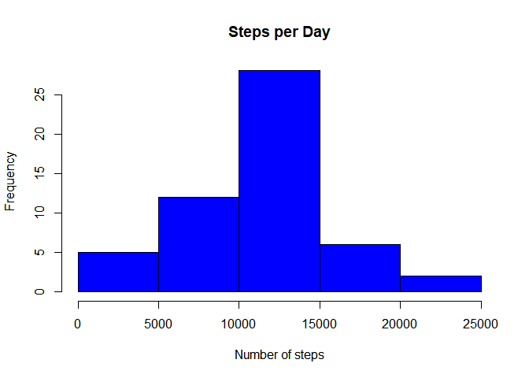
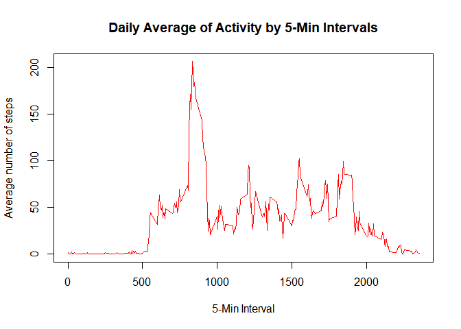
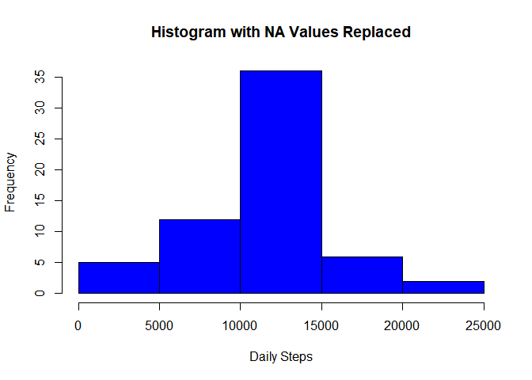
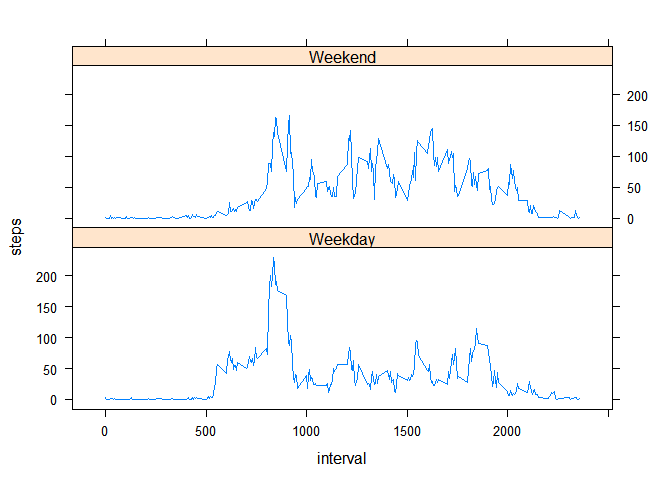

## Loading and preprocessing the data

I unzip the file into the working directory. I read the data in and assign it as "act".


```r
 unzip("activity.zip")
 act <- read.csv("activity.csv")
```

I summarize the data.


```r
summary(act)
```

```
##      steps            date              interval     
##  Min.   :  0.00   Length:17568       Min.   :   0.0  
##  1st Qu.:  0.00   Class :character   1st Qu.: 588.8  
##  Median :  0.00   Mode  :character   Median :1177.5  
##  Mean   : 37.38                      Mean   :1177.5  
##  3rd Qu.: 12.00                      3rd Qu.:1766.2  
##  Max.   :806.00                      Max.   :2355.0  
##  NA's   :2304
```

## What is mean total number of steps taken per day?
There are 53 unique dates on which data was recorded.


```r
length(unique(act$date))
```

```
## [1] 61
```

I load the package dplyr in order to process the data.Then I group the data under dates and calculate the total number of steps taken per day, storing the results in "daily_steps".


```r
library(dplyr)
```

```
## Warning: package 'dplyr' was built under R version 4.0.4
```

```
## 
## Attaching package: 'dplyr'
```

```
## The following objects are masked from 'package:stats':
## 
##     filter, lag
```

```
## The following objects are masked from 'package:base':
## 
##     intersect, setdiff, setequal, union
```

```r
daily_steps <- summarise(group_by(act, date), total = sum(steps))
```

I create a histogram of the total number of steps taken each day.


```r
hist(daily_steps$total, main="Steps per Day", xlab="Number of steps", col = "blue")
```

<!-- -->

I calculate the mean and median of the total number of steps taken per day.


```r
mean(daily_steps$total, na.rm = TRUE)
```

```
## [1] 10766.19
```

```r
median(daily_steps$total, na.rm = TRUE)
```

```
## [1] 10765
```

## What is the average daily activity pattern?

I process the data and take the average of steps taken in each 5-minute interval across all days.

```r
by_intervals <- aggregate(steps ~ interval, act, mean)
```

I construct a time series plot of the 5-minute interval (x-axis) and the average number of steps taken, averaged across all days (y-axis).


```r
plot(by_intervals$interval, by_intervals$steps, type='l', main="Daily Average of Activity by 5-Min Intervals", xlab="5-Min Interval", ylab="Average number of steps", col="red")
```

<!-- -->

I find out the 5 minute interval with the highest daily average.


```r
which.max(by_intervals$steps)
```

```
## [1] 104
```

```r
by_intervals[104, ]
```

```
##     interval    steps
## 104      835 206.1698
```

## Imputing missing values

I calculate the number of missing values.


```r
sum(is.na(act))
```

```
## [1] 2304
```

My strategy to impute the NA values is to replace them with each corresponding interval's mean. The average number of steps for each interval is already stored in "by_intervals". I make R replace each NA value in "act" with the corresponding mean from the "by_intervals" data frame.


```r
for (i in 1:nrow(act)){
  if (is.na(act$steps[i])){
    interval_no <- act$interval[i]
    row_no <- which(by_intervals$interval == interval_no)
    steps_ave <- by_intervals$steps[row_no]
    act$steps[i] <- steps_ave
  }
}
```

I create a histogram of daily steps using the imputed data.


```r
imputed <- aggregate(act$steps ~ act$date, act, sum)
hist(imputed$`act$steps`, col="blue", main = "Histogram with NA Values Replaced", xlab="Daily Steps")
```

<!-- -->
Calculating the mean and median of the new data, I observe that the mean did not change from what it was before NA values were imputed and the median is now equal to that value.

```r
mean(imputed$`act$steps`)
```

```
## [1] 10766.19
```

```r
median(imputed$`act$steps`)
```

```
## [1] 10766.19
```

## Are there differences in activity patterns between weekdays and weekends?

I extract the day information using the "weekdays" function and store it in a new object named "days".


```r
days <- weekdays(as.Date(act$date))
```

I create a new factor variable in the dataset with two levels – “weekday” and “weekend” indicating whether a given date is a weekday or weekend day. Using the "days" vector to seperate the between the two levels.


```r
wd_or_we <- vector()
for (i in 1:nrow(act)) {
  if (days[i] == "Cumartesi") {
    wd_or_we[i] <- "Weekend"
  } else if (days[i] == "Pazar") {
    wd_or_we[i] <- "Weekend"
  } else {
    wd_or_we[i] <- "Weekday"
  }
}

act_by_day <- aggregate(steps ~ interval + wd_or_we, data = act, FUN = mean)
```


I load the lattice package. I make a panel plot containing a time series plot of the 5-minute interval (x-axis) and the average number of steps taken, averaged across all weekday days or weekend days (y-axis). 


```r
library(lattice)
xyplot(steps ~ interval | wd_or_we, act_by_day, type = "l", layout = c(1, 2))
```

<!-- -->
